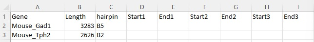
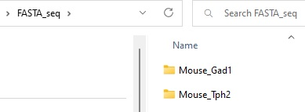
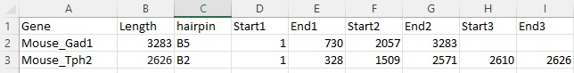

# Probe_Design_ver1
Probe design method for in situ HCR method (ver1)

# How to design the probes using the scripts

## 1. Obtain reference sequence from NCBI

Example1, Gad1 gene, mRNA reference sequence NM_008077.5, 3283 bp

https://www.ncbi.nlm.nih.gov/nuccore/NM_008077.5

FASTA sequence
>NM_008077.5 Mus musculus glutamate decarboxylase 1 (Gad1), transcript variant 1, mRNA
GCCTCCCCCAAGCCCAGCGGCCGCCTCTCCGGATCTCTCCCTTCTTCAGGCTCTCCCGTGCCGGACCAGG
GATCGTGCAAGCAAGGAAGCAGCCCTGGGGTGACACCCAGCACGTACTCCTGTGACAGAGCCGAGCCCAG
CCCAGCCCCGGGACGCTTCGCAGAGGAGTCGCGGGAGGGTCCAGCTCGCTGTCGCTGAACCGAGCCTGTT
CCTGCGCCCAGTCTGCGGGGGACCCTTGAACCGTAGAGACCCCAAGACCACCGAGCTGATGGCATCTTCC
ACTCCTTCGCCTGCAACCTCCTCGAACGCGGGAGCGGATCCTAATACTACCAACCTGCGCCCTACAACGT
ATGATACTTGGTGTGGCGTAGCCCATGGATGCACCAGAAAACTGGGCCTGAAGATCTGTGGCTTCTTACA
AAGGACCAATAGCCTGGAAGAGAAGAGTCGTCTTGTGAGCGCCTTCAGGGAGAGGCAGTCCTCCAAGAAC
CTGCTTTCCTGTGAAAACAGTGACCAGGGTGCCCGCTTCCGGCGCACAGAGACCGACTTCTCCAACCTGT
TTGCTCAAGATCTGCTTCCAGCTAAGAACGGGGAGGAGCAAACTGCGCAGTTCTTGCTGGAAGTGGTAGA
CATACTCCTCAACTATGTCCGCAAGACATTTGATCGCTCCACCAAGGTTCTGGATTTCCACCACCCACAC
CAGTTGCTGGAAGGCATGGAAGGCTTTAATTTGGAGCTGTCTGACCACCCCGAGTCTCTGGAGCAGATCC
TGGTTGACTGTAGAGACACCCTGAAGTACGGGGTTCGCACAGGTCACCCTCGATTTTTCAACCAGCTCTC
TACTGGTTTGGATATCATTGGTTTAGCTGGTGAATGGCTGACATCGACTGCCAATACCAATATGTTCACA
TATGAAATTGCACCCGTGTTTGTTCTCATGGAACAGATTACTCTTAAGAAGATGAGAGAGATCGTTGGAT
GGTCAAATAAAGATGGTGATGGGATATTTTCTCCTGGGGGAGCCATATCCAATATGTACAGCATCATGGC
TGCTCGTTACAAGTACTTCCCAGAAGTGAAGACAAAAGGCATGGCGGCTGTGCCCAAACTGGTCCTCTTC
ACCTCAGAACACAGTCACTATTCCATAAAGAAAGCCGGGGCTGCGCTTGGCTTTGGAACCGACAATGTGA
TTTTGATAAAGTGCAATGAAAGGGGGAAGATAATTCCGGCTGATTTAGAGGCAAAAATTCTTGATGCCAA
ACAAAAGGGCTATGTTCCCCTTTATGTCAATGCAACCGCAGGCACGACTGTTTACGGAGCATTCGATCCA
ATCCAGGAAATTGCGGACATATGTGAGAAATACAACCTTTGGCTGCATGTGGATGCTGCCTGGGGTGGTG
GACTGCTCATGTCCCGGAAGCACCGCCACAAACTCAGCGGCATAGAAAGGGCCAATTCAGTCACCTGGAA
CCCTCACAAGATGATGGGCGTGCTGCTCCAGTGCTCTGCCATTCTGGTCAAGGAAAAGGGTATACTCCAA
GGATGCAACCAGATGTGTGCAGGCTACCTCTTCCAGCCAGACAAGCAGTATGACGTCTCCTATGACACCG
GGGACAAGGCGATTCAGTGTGGCCGCCATGTGGACATCTTCAAGTTCTGGCTGATGTGGAAAGCAAAGGG
CACCGTGGGATTTGAAAACCAGATCAACAAATGCCTGGAGCTGGCTGATTACCTCTACGCCAAGATTAAA
AACAGAGAAGAGTTTGAGATGGTTTTCGATGGTGAGCCTGAGCACACAAATGTCTGTTTCTGGTACATTC
CACAAAGCCTTCGAGGGGTTCCAGATAGCCCTGAGCGACGAGAAAAGCTACACAGGGTGGCTCCCAAGAT
CAAAGCTCTGATGATGGAGTCAGGAACAACCATGGTGGGCTACCAGCCTCAAGGGGACAAGGCCAACTTC
TTCCGGATGGTCATCTCTAACCCAGCCGCCACCCAGTCTGACATCGATTTCCTCATTGAGGAGATAGAGA
GGTTGGGTCAGGATCTGTAATCCCTCTTTACAGAACCAGAATCATCGGCCATGCTTGTGCCCCTCTGGTA
CCCTAGAGCACAGCTCTGTCAGTAGCTGACACATCTAGGCCATCTCACTGAAGGAAATTACAATCTCTTA
AAGAATATTTGTCACATTTCACATAAGCTTGTTTGTTAGAGCTAGTGGGGAAATAATGTTCTTTTTAAAA
AATTGCACATTAGAAACACAGTATATATGTACAGTTATATATACCTCTCTCTATGTACATGTATGTATAG
TGACTGTGGCTTAGTCCTAGACCATAGCATGTTGCTCGTCCCCAGGAAATTAGCCTTACCCCCAGCAATT
ACTAAGAGGCTAAACCATCTCGCAAGCAACTACAGGGCGGATGGTATCCCTACTGCAGTGTCCTAGGGAC
CCAGGGAAAGGCTGTTGGTGGGAGGCTACCTCCCTGCTAGAGCTGTTCCCACGTGAAGGGATGATGGATG
ACAGATGTACCAGTAAATGACAAATGTCACACCCTCCCTGTTAGTACCCTGCTAGGGGAAATAGTAGCAG
TCTTTGTCACAATTGTGCTTTGCTGTGTTTTAGAGATTAATCTGTGTAAACTGTGTACATTGCCATTGTC
TATCTTTGGGCAGGGGGAAGTGCATATAATGATTAAATTGTATGTCAGTGAGATATCTGCTTATTTATAT
TCAAATATATACCATGTTAAAGAGACATCTTGTATTTTCTTCCCATTTGTAATGTATCTTATTTATATAT
TAATGGAGTAAGTTCTGGATACTGTTTATGGTATTTTCGTGCATTTGTGAGCCAAAGAGAAAAGATGAAA
ATTAGTGAGATTTGCATTTATATTAGAGTGCCCTTAACATAATGATTTGAACATATGTGTACTGTCTGGA
AAAGAATTCTGATACTGTACATAGAGTCATGTTATGGAAATCTTGCTTCAGTAGCCTTCGCTCTTCTCTT
TCCCCCCTCAGGCTGTATGTCAGATGTTCTCAAAGCTTTTCTAGTAACTGTTGAATAATAATAACTAGAT
CTCCTGTAATTTTGTAGTAGTATATGACCAATCTCTGTGACTCGCTTAGCTGAAACCTAAGGCAATGTTT
CTGAAGACCTCCGATACACTGACCAGTCCCACAAGTGTTTTTGAAGACATGAAACCCACACTGTGCATTT
AGGGTGTGCAAGAAGAATATAAATAAAATAAAAAATATTCTCCATGAAAAAAAAAAAAAAAAA

Example2, Tph2 gene, mRNA reference sequence NM_173391.3, 2626 bp

https://www.ncbi.nlm.nih.gov/nuccore/NM_173391.3

FASTA sequence
>NM_173391.3 Mus musculus tryptophan hydroxylase 2 (Tph2), mRNA
CACTGCTCTTCAGCACCAGGGTTCTGGACAGCGCCCCGAGCAGGCAGCTGCCACTGCAGTTCCTCCTTCA
TCTCTGCCAAGGCCGCCCCTCTGGTCCCCCCTGCTGCTGAGAAAGAAAATTACATCGGGAGCCATGCAGC
CCGCAATGATGATGTTTTCCAGTAAATACTGGGCCAGGAGAGGGTTGTCCTTGGATTCTGCTGTGCCAGA
AGATCATCAGCTACTTGGCAGCTTAACACAAAATAAGGCTATCAAAAGCGAGGACAAGAAAAGCGGCAAA
GAGCCCGGCAAAGGCGACACCACAGAGAGCAGCAAGACAGCGGTAGTGTTCTCCTTGAAGAATGAAGTTG
GTGGGCTGGTGAAAGCACTTAGACTATTCCAGGAAAAACATGTCAACATGCTTCATATCGAATCCAGGAG
GTCCCGACGAAGAAGTTCTGAAGTCGAAATCTTCGTGGACTGCGAATGTGGCAAAACGGAATTCAATGAG
CTCATCCAGTTGCTGAAATTTCAGACCACCATTGTGACCCTGAATCCGCCTGAGAGCATTTGGACGGAGG
AAGAAGATCTCGAGGATGTGCCGTGGTTCCCTCGGAAGATCTCTGAGTTAGACAGATGCTCTCACCGAGT
CCTCATGTACGGCACCGAGCTTGATGCCGACCATCCAGGATTTAAGGACAATGTCTATCGACAGAGGAGG
AAGTATTTTGTGGATGTGGCCATGGGCTATAAATATGGTCAGCCCATTCCCAGGGTCGAGTACACAGAAG
AAGAGACTAAAACTTGGGGTGTTGTGTTCCGGGAGCTCTCCAAACTCTACCCGACTCATGCTTGCCGGGA
GTACCTGAAAAACCTCCCCCTGCTGACCAAGTACTGTGGCTACAGGGAAGACAACGTGCCGCAACTGGAA
GACGTCTCCATGTTTCTGAAAGAGCGATCTGGCTTCACAGTGAGACCAGTGGCTGGCTACCTGAGCCCAA
GAGACTTCCTGGCGGGCCTGGCCTACAGAGTATTCCACTGCACCCAGTACGTGCGGCATGGCTCCGACCC
CCTCTACACCCCGGAACCAGATACATGCCATGAACTCTTGGGACACGTGCCACTGCTTGCGGATCCCAAG
TTTGCTCAGTTTTCCCAAGAGATAGGCTTAGCGTCTCTGGGAGCCTCAGATGAGGACGTTCAGAAACTAG
CCACGTGCTATTTCTTCACAATCGAGTTCGGCCTTTGCAAGCAAGAGGGTCAACTGCGGGCGTATGGAGC
AGGGTTACTTTCGTCCATCGGAGAATTGAAGCATGCTCTTTCCGACAAGGCGTGTGTGAAATCCTTTGAC
CCAAAGACGACCTGCTTGCAGGAATGCCTAATCACCACCTTTCAGGACGCTTACTTTGTTTCGGACAGTT
TTGAAGAAGCCAAAGAAAAGATGAGGGACTTTGCAAAGTCAATTACCCGTCCCTTCTCGGTATACTTCAA
CCCCTACACGCAGAGCATTGAAATTCTGAAAGACACCAGAAGTATTGAGAATGTGGTGCAGGACCTGCGC
AGTGATTTGAACACAGTGTGTGATGCCTTGAATAAAATGAACCAATATCTGGGGATTTGATGCCTAGAAC
CAGAGTTATTGTCAGCATGAGCTCTTGGGGGGTGTAGCAACAATGCAGTCAATGTTATCCAACATCAACA
ACTTTCTGTGTCATGGTTGGCTAGTAAGCATGCAATTCTGTATGTCCATACCTCTGTGTAACTTAATAAC
ACAAAAATGCTCTAAAGAACCCATGCAGATAACCACTCACCATTTGAAAGATTGTGATCCTATTTGGACA
TCTCAAGTAGAGTTGACATTTCTGATTAGCGAACAAACTGTTAACTTAAGCAAACTGTGACTTTGAAATC
TGTAGCAAACATTCCTCGCACAATTCCAGTCGGTGAGTTGTGGAACTTTTCTTCCTTGGACCTGAGACTT
TCCTCTGTGTTCATTAGATAAAATGAAAATAGTTGGGAGGTGGTTTCTATTTTCAATAGTATCCGTGTTA
TTTGAGATAAACTAGAGTTGCTCCACGCTTTGCATCACAGCAACAAAGGATTTAATATTCTACTTCAGAA
GCTGTTCAGAAACACAGCAGTTGGGATGGATGTAGACTGAGTGTTCAGACAATGCAAGCAAAGAAAAGTT
TTGATAAACAGGATATATAGGTTGTACTGACCTCGTTGAAACCAATTTGTGGCAAGCTTCCTGAAGAGCT
TCTGGAAGGAAACACTTGAACAAAGAATATTCGGGAAGCTTAAACAGAAGGGATGAAAATCTTGGAACTG
TGAATGTATTGTTAGGATAGAGTGAATTATCACTGCAGGCTTTTGACTCCTTTTGCTTAGACTGAGAACC
TCAAATCCCACAGGGATGTAAATACCATCTCTGATTCCAAAGAGTTGGAGACGGAGTCGTAGAGAAACAA
AGGGATTTGCTTCAGTTAGGTCTGATGAGATGTGCCATGGTCATAAGCCACTGCCCTTTTATGTTGGACA
TCTGACAAGTCTACTGTAGTGTACATGCATGTTTATGTATTGACACAGAAAGAAAATTATTGCTTATAAA
ATGAATGCTTCTCAATAAACAGAATCTTGCCCCCAA

## 2. Make a probe table 

1. Enter the length of the target RNA
2. Enter the hairpin type you like to make

## 3. Make a folder structure
Fasta_seq >Mouse_Gad1
          >Mouse_Tph2

## 4. Perform BLAST sequence similarity check

## 5. Enter the target region using MATLAB script

## 5. Run the script using the table
